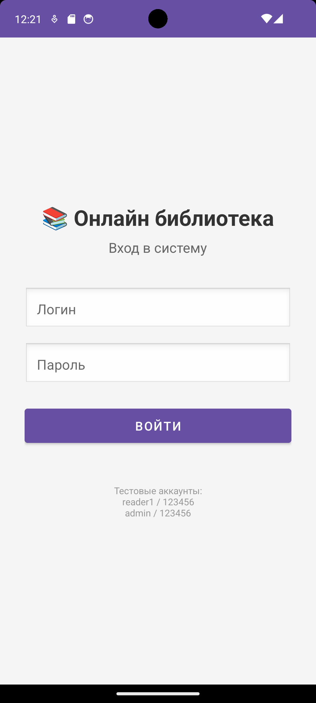
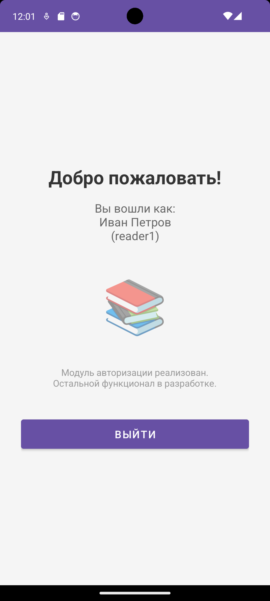
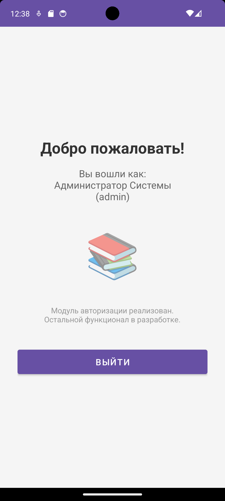
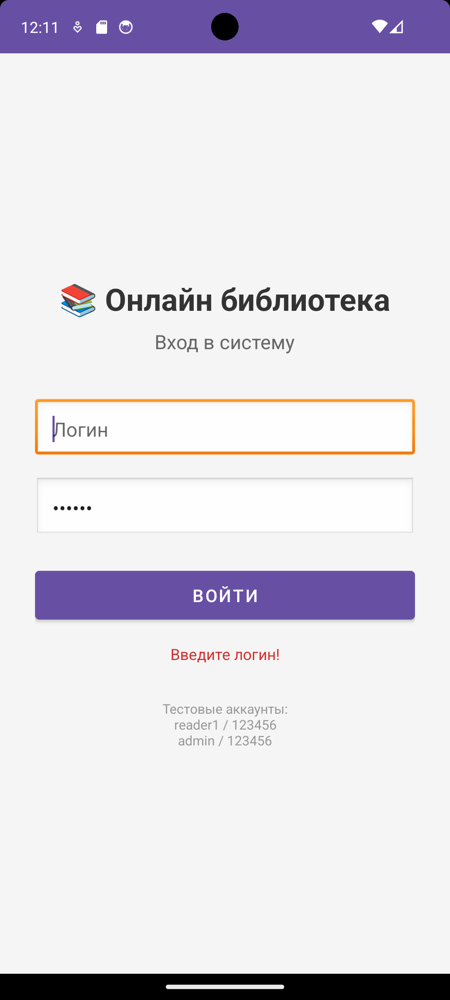
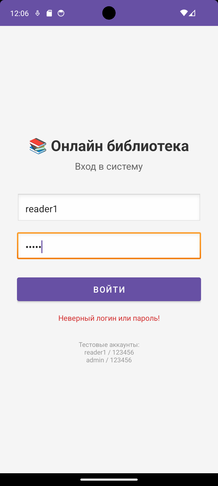
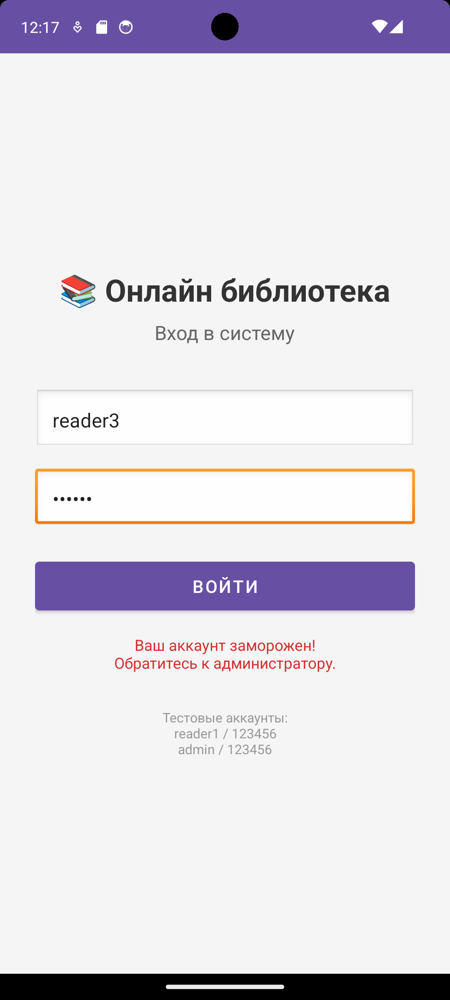

# Инструкция по запуску Онлайн библиотеки (OnlineLibrary)

## Требования
- Visual Studio 2019/2022
- SQL Server 2019/2022 (Express или выше)
- SQL Server Management Studio (SSMS)

## Установка

### 1. Создание базы данных
1. Откройте SQL Server Management Studio
2. Подключитесь к серверу (обычно `.\SQLEXPRESS`)
3. Откройте файл `02_WPF_App/Database/OnlineLibrary.sql`
4. Выполните скрипт (F5)

### 2. Настройка подключения
1. Откройте проект в Visual Studio
2. Откройте файл `App.config`
3. Найдите строку подключения `OnlineLibraryEntities`
4. Измените `data source=.\SQLEXPRESS` на имя вашего сервера
5. Сохраните файл

### 3. Запуск приложения
1. Нажмите F5 в Visual Studio
2. Войдите в систему:
   - **Администратор:** логин `admin`, пароль `123456`
   - **Пользователь:** логин `reader1`, пароль `123456`

## Учётные данные

| Роль | Логин | Пароль |
|------|-------|--------|
| Администратор | admin | 123456 |
| Пользователь | reader1 | 123456 |
| Пользователь | reader2 | 123456 |
| Пользователь (заморожен) | reader3 | 123456 |
| Пользователь | reader4 | 123456 |

## Примечание о безопасности
Пароли хранятся в открытом виде (plain text) для упрощения демонстрации.
В промышленной версии необходимо использовать хэширование (bcrypt/Argon2).

## 🧪 Тестирование WPF-приложения

В рамках учебной практики проведено комплексное ручное тестирование разработанного WPF-приложения «Онлайн библиотека» методом «белого ящика». Всего разработано и выполнено **49 тестовых сценариев** (позитивных и негативных), охватывающих все функциональные модули системы.

---

### 1. Сводная таблица тестовых сценариев

| № | ID теста | Название | Приоритет |
|---|----------|----------|-----------|
| 1 | TC_AUTH_001 | Вход с корректными учётными данными | Высокий |
| 2 | TC_AUTH_002 | Вход с некорректным паролем | Высокий |
| 3 | TC_AUTH_003 | Регистрация нового пользователя | Высокий |
| 4 | TC_AUTH_004 | Вход замороженного пользователя | Высокий |
| 5 | TC_NAV_005 | Навигация через Sidebar | Высокий |
| 6 | TC_NAV_006 | Скрытие кнопки «Администрирование» для обычного пользователя | Высокий |
| 7 | TC_NAV_007 | Отображение предупреждения о заморозке в Sidebar (FR-2.5) | Высокий |
| 8 | TC_CAT_008 | Поиск книг по названию | Высокий |
| 9 | TC_CAT_009 | Поиск книг по автору | Высокий |
| 10 | TC_CAT_010 | Сортировка по названию | Средний |
| 11 | TC_CAT_011 | Сортировка по оценке | Средний |
| 12 | TC_CAT_012 | Фильтрация по жанрам | Средний |
| 13 | TC_CAT_013 | Добавление книги в список из каталога | Высокий |
| 14 | TC_BOOK_014 | Открытие страницы книги | Высокий |
| 15 | TC_BOOK_015 | Оставление отзыва с оценкой (FR-4.4) | Высокий |
| 16 | TC_BOOK_016 | Редактирование своего отзыва | Высокий |
| 17 | TC_BOOK_017 | Удаление своего отзыва | Высокий |
| 18 | TC_BOOK_018 | Жалоба на чужой отзыв (FR-4.5) | Высокий |
| 19 | TC_BOOK_019 | Жалоба на книгу (FR-4.3) | Высокий |
| 20 | TC_BOOK_020 | Заморозка книги администратором (FR-4.6) | Высокий |
| 21 | TC_BOOK_021 | Заморозка отзыва администратором (FR-4.7) | Высокий |
| 22 | TC_BOOK_022 | Запрет действий для замороженного пользователя | Высокий |
| 23 | TC_LIST_023 | Переключение между списками книг | Высокий |
| 24 | TC_LIST_024 | Перемещение книги между списками | Высокий |
| 25 | TC_LIST_025 | Удаление книги из списка | Высокий |
| 26 | TC_PROF_026 | Отображение информации о пользователе (FR-6.1) | Средний |
| 27 | TC_PROF_027 | Просмотр своих отзывов (FR-6.2) | Средний |
| 28 | TC_PROF_028 | Оспаривание заморозки аккаунта (FR-6.4) | Высокий |
| 29 | TC_PROF_029 | Скрытие отзывов в профиле для администратора | Средний |
| 30 | TC_ADMIN_030 | Доступ к списку жалоб (FR-7.1) | Высокий |
| 31 | TC_ADMIN_031 | Принятие жалобы (FR-7.2) | Высокий |
| 32 | TC_ADMIN_032 | Отклонение жалобы (FR-7.3) | Высокий |
| 33 | TC_ADMIN_033 | Доступ к заявкам на разморозку (FR-7.4) | Высокий |
| 34 | TC_ADMIN_034 | Принятие заявки на разморозку (FR-7.5) | Высокий |
| 35 | TC_ADMIN_035 | Отклонение заявки на разморозку (FR-7.6) | Высокий |
| 36 | TC_ADMIN_036 | Просмотр замороженного контента (FR-7.7, FR-7.8, FR-7.9) | Средний |
| 37 | TC_ADMIN_037 | Смена роли пользователя (FR-7.11) | Высокий |
| 38 | TC_ADMIN_038 | Защита последнего администратора | Высокий |
| 39 | TC_ADMIN_039 | Смена пароля пользователя (FR-7.12) | Средний |
| 40 | TC_DUP_040 | Повторная жалоба на уже замороженную книгу | Высокий |
| 41 | TC_VAL_041 | Валидация: пустой текст отзыва | Высокий |
| 42 | TC_VAL_042 | Валидация: не выбрана оценка | Высокий |
| 43 | TC_VAL_043 | Запрет отзывов для администратора | Высокий |
| 44 | TC_VAL_044 | Запрет редактирования замороженного отзыва | Высокий |
| 45 | TC_EDGE_045 | Пустой поиск отображает все книги | Средний |
| 46 | TC_EDGE_046 | Слишком длинный текст отзыва (>1000 символов) | Высокий |
| 47 | TC_EDGE_047 | Регистрация с существующим логином | Высокий |
| 48 | TC_FREEZE_048 | Запрет отзыва на замороженную книгу | Высокий |
| 49 | TC_FREEZE_049 | Скрытие замороженных отзывов от обычных пользователей | Высокий |

---

### 2. Детальное описание тестовых сценариев

<b>Тестовый пример №1 (TC_AUTH_001)</b> — Вход с корректными учётными данными

| Поле | Значение |
|------|----------|
| **Тестовый пример #** | TC_AUTH_001 |
| **Приоритет тестирования** | Высокий |
| **Заголовок/название теста** | Вход с корректными учётными данными |
| **Краткое изложение теста** | Проверка успешной авторизации пользователя с правильными логином и паролем |
| **Этапы теста** | 1. Запустить приложение 2. Ввести логин `reader1` 3. Ввести пароль `123456` 4. Нажать кнопку «Войти» |
| **Тестовые данные** | login=`reader1`, password=`123456` |
| **Ожидаемый результат** | Открывается главное окно приложения с боковой панелью навигации. По умолчанию открыт каталог книг. |
| **Фактический результат** | Авторизация прошла успешно. Открыто главное окно с Sidebar. Каталог книг отображается корректно. |
| **Статус** | ✅ Пройден |
| **Предварительное условие** | Приложение запущено, отображается страница входа |
| **Постусловие** | Пользователь авторизован в системе |
| **Примечания/комментарии** | FR-1.3: Проверка корректности учётных данных |

<b>Тестовый пример №2 (TC_AUTH_002)</b> — Вход с некорректным паролем

| Поле | Значение |
|------|----------|
| **Тестовый пример #** | TC_AUTH_002 |
| **Приоритет тестирования** | Высокий |
| **Заголовок/название теста** | Вход с некорректным паролем |
| **Краткое изложение теста** | Проверка, что при вводе неверного пароля выводится сообщение об ошибке |
| **Этапы теста** | 1. Ввести логин `reader1` 2. Ввести пароль `wrongpass` 3. Нажать кнопку «Войти» |
| **Тестовые данные** | login=`reader1`, password=`wrongpass` |
| **Ожидаемый результат** | Появляется сообщение «Неверный пароль!». Пользователь остаётся на странице входа. |
| **Фактический результат** | Отображено сообщение «Неверный пароль!». Переход в главное окно не выполнен. |
| **Статус** | ✅ Пройден |
| **Предварительное условие** | Приложение запущено |
| **Постусловие** | Пользователь не авторизован |
| **Примечания/комментарии** | FR-1.3: Проверка корректности учётных данных |

<b>Тестовый пример №3 (TC_AUTH_003)</b> — Регистрация нового пользователя

| Поле | Значение |
|------|----------|
| **Тестовый пример #** | TC_AUTH_003 |
| **Приоритет тестирования** | Высокий |
| **Заголовок/название теста** | Регистрация нового пользователя |
| **Краткое изложение теста** | Проверка возможности создать новую учётную запись |
| **Этапы теста** | 1. На странице входа нажать «Зарегистрироваться» 2. Заполнить форму: логин `testuser`, email `test@mail.ru`, имя `Тест Тестов`, пароль `111111` 3. Нажать кнопку «Зарегистрироваться» |
| **Тестовые данные** | login=`testuser`, email=`test@mail.ru`, name=`Тест Тестов`, password=`111111` |
| **Ожидаемый результат** | Появляется сообщение об успешной регистрации. Выполняется автоматический вход в систему. |
| **Фактический результат** | Регистрация прошла успешно. Пользователь создан и автоматически авторизован. |
| **Статус** | ✅ Пройден |
| **Предварительное условие** | Приложение запущено, отображается страница входа |
| **Постусловие** | Новый пользователь создан и авторизован |
| **Примечания/комментарии** | FR-1.2: Возможность регистрации нового пользователя |

<b>Тестовый пример №4 (TC_AUTH_004)</b> — Вход замороженного пользователя

| Поле | Значение |
|------|----------|
| **Тестовый пример #** | TC_AUTH_004 |
| **Приоритет тестирования** | Высокий |
| **Заголовок/название теста** | Вход замороженного пользователя |
| **Краткое изложение теста** | Проверка, что замороженный пользователь может войти в систему и видит предупреждение |
| **Этапы теста** | 1. Ввести логин `reader3` 2. Ввести пароль `123456` 3. Нажать кнопку «Войти» 4. Проверить наличие красной иконки ⚠️ в боковой панели |
| **Тестовые данные** | login=`reader3`, password=`123456` (пользователь заморожен) |
| **Ожидаемый результат** | Пользователь входит в систему. В боковой панели появляется красная иконка ⚠️ с подсказкой «Ваш аккаунт заморожен. Причина: Нарушение правил сообщества». |
| **Фактический результат** | Вход выполнен успешно. В боковой панели отображается красная иконка ⚠️. При наведении появляется подсказка с причиной заморозки. |
| **Статус** | ✅ Пройден |
| **Предварительное условие** | Пользователь reader3 заморожен |
| **Постусловие** | Пользователь авторизован с ограничениями |
| **Примечания/комментарии** | FR-2.5: Предупреждение о заморозке в Sidebar |

<b>Тестовый пример №5 (TC_NAV_005)</b> — Навигация через Sidebar

| Поле | Значение |
|------|----------|
| **Тестовый пример #** | TC_NAV_005 |
| **Приоритет тестирования** | Высокий |
| **Заголовок/название теста** | Навигация через Sidebar |
| **Краткое изложение теста** | Проверка корректной работы всех пунктов боковой панели |
| **Этапы теста** | 1. Войти как reader1 2. Нажать кнопку 📚 (Каталог книг) 3. Нажать кнопку 📋 (Списки книг) 4. Нажать кнопку 👤 (Профиль) 5. Навести курсор на каждую кнопку |
| **Тестовые данные** | — |
| **Ожидаемый результат** | При нажатии на каждую кнопку открывается соответствующая страница. При наведении появляются всплывающие подсказки. |
| **Фактический результат** | Все страницы открываются корректно. Всплывающие подсказки отображаются для всех кнопок. |
| **Статус** | ✅ Пройден |
| **Предварительное условие** | Пользователь авторизован |
| **Постусловие** | — |
| **Примечания/комментарии** | FR-2.1, FR-2.7, FR-2.8: Sidebar с иконками и подсказками |

<b>Тестовый пример №6 (TC_NAV_006)</b> — Скрытие кнопки «Администрирование» для обычного пользователя

| Поле | Значение |
|------|----------|
| **Тестовый пример #** | TC_NAV_006 |
| **Приоритет тестирования** | Высокий |
| **Заголовок/название теста** | Скрытие кнопки «Администрирование» для обычного пользователя |
| **Краткое изложение теста** | Проверка, что пункт «Администрирование» доступен только администраторам |
| **Этапы теста** | 1. Войти как reader1 (обычный пользователь) 2. Проверить отсутствие кнопки ️ в боковой панели 3. Выйти из системы 4. Войти как admin (администратор) 5. Проверить наличие кнопки ⚙️ |
| **Тестовые данные** | reader1 (RoleId=1), admin (RoleId=2) |
| **Ожидаемый результат** | У обычного пользователя кнопка «Администрирование» отсутствует. У администратора кнопка присутствует. |
| **Фактический результат** | Кнопка ⚙️ скрыта для reader1 и отображается для admin. |
| **Статус** | ✅ Пройден |
| **Предварительное условие** | Оба пользователя существуют в системе |
| **Постусловие** | — |
| **Примечания/комментарии** | FR-2.4, NFR-2.2: Разграничение прав доступа |

<b>Тестовый пример №7 (TC_NAV_007)</b> — Отображение предупреждения о заморозке в Sidebar (FR-2.5)

| Поле | Значение |
|------|----------|
| **Тестовый пример #** | TC_NAV_007 |
| **Приоритет тестирования** | Высокий |
| **Заголовок/название теста** | Отображение предупреждения о заморозке в Sidebar (FR-2.5) |
| **Краткое изложение теста** | Проверка, что иконка предупреждения видна только замороженным пользователям |
| **Этапы теста** | 1. Войти как reader1 (не заморожен) 2. Проверить отсутствие иконки ⚠️ в боковой панели 3. Выйти из системы 4. Войти как reader3 (заморожен) 5. Проверить наличие иконки ⚠️ 6. Навести курсор на иконку — проверить подсказку 7. Нажать на иконку |
| **Тестовые данные** | reader1 (IsFrozen=0), reader3 (IsFrozen=1) |
| **Ожидаемый результат** | У reader1 иконка отсутствует. У reader3 иконка присутствует. При наведении отображается подсказка с причиной заморозки. При клике открывается страница профиля. |
| **Фактический результат** | У reader1 иконка ⚠️ отсутствует. У reader3 иконка отображается. Подсказка и переход в профиль работают корректно. |
| **Статус** | ✅ Пройден |
| **Предварительное условие** | Оба пользователя существуют в системе |
| **Постусловие** | — |
| **Примечания/комментарии** | FR-2.5: Пункт «Предупреждение о заморозке аккаунта» должен отображаться только если аккаунт заморожен |

<b>Тестовый пример №8 (TC_CAT_008)</b> — Поиск книг по названию

| Поле | Значение |
|------|----------|
| **Тестовый пример #** | TC_CAT_008 |
| **Приоритет тестирования** | Высокий |
| **Заголовок/название теста** | Поиск книг по названию |
| **Краткое изложение теста** | Проверка работы поиска по названию книги |
| **Этапы теста** | 1. Войти как reader1 2. Открыть каталог книг 3. В поле «Название» ввести `Звёздный` 4. Нажать кнопку «🔍 Найти» |
| **Тестовые данные** | searchTitle=`Звёздный` |
| **Ожидаемый результат** | В каталоге отображаются только книги, название которых содержит «Звёздный» (книга «Звёздный путь»). |
| **Фактический результат** | Отображается только книга «Звёздный путь». Другие книги скрыты. |
| **Статус** | ✅ Пройден |
| **Предварительное условие** | Пользователь авторизован, каталог открыт |
| **Постусловие** | — |
| **Примечания/комментарии** | FR-3.4: Каталог должен поддерживать поиск по названию книги |

<b>Тестовый пример №9 (TC_CAT_009)</b> — Поиск книг по автору

| Поле | Значение |
|------|----------|
| **Тестовый пример #** | TC_CAT_009 |
| **Приоритет тестирования** | Высокий |
| **Заголовок/название теста** | Поиск книг по автору |
| **Краткое изложение теста** | Проверка работы поиска по автору книги |
| **Этапы теста** | 1. Очистить поле «Название» 2. В поле «Автор» ввести `Орлов` 3. Нажать кнопку «🔍 Найти» |
| **Тестовые данные** | searchAuthor=`Орлов` |
| **Ожидаемый результат** | Отображаются только книги автора «Дмитрий Орлов» (книга «Звёздный путь»). |
| **Фактический результат** | Отображается только книга «Звёздный путь» автора Дмитрия Орлова. |
| **Статус** | ✅ Пройден |
| **Предварительное условие** | Пользователь авторизован |
| **Постусловие** | — |
| **Примечания/комментарии** | FR-3.5: Каталог должен поддерживать поиск по автору |

<b>Тестовый пример №10 (TC_CAT_010)</b> — Сортировка по названию

| Поле | Значение |
|------|----------|
| **Тестовый пример #** | TC_CAT_010 |
| **Приоритет тестирования** | Средний |
| **Заголовок/название теста** | Сортировка по названию |
| **Краткое изложение теста** | Проверка сортировки книг по алфавиту названия |
| **Этапы теста** | 1. Очистить поля поиска 2. В выпадающем списке сортировки выбрать «По названию» 3. Проверить порядок отображения книг |
| **Тестовые данные** | sort=`По названию` |
| **Ожидаемый результат** | Книги отсортированы по алфавиту названия (А-Я). |
| **Фактический результат** | Книги отображаются в алфавитном порядке. |
| **Статус** | ✅ Пройден |
| **Предварительное условие** | Пользователь авторизован |
| **Постусловие** | — |
| **Примечания/комментарии** | FR-3.6: Каталог должен поддерживать сортировку по имени |

<b>Тестовый пример №11 (TC_CAT_011)</b> — Сортировка по оценке

| Поле | Значение |
|------|----------|
| **Тестовый пример #** | TC_CAT_011 |
| **Приоритет тестирования** | Средний |
| **Заголовок/название теста** | Сортировка по оценке |
| **Краткое изложение теста** | Проверка сортировки книг по среднему рейтингу |
| **Этапы теста** | 1. В выпадающем списке сортировки выбрать «По оценке» 2. Проверить порядок отображения книг |
| **Тестовые данные** | sort=`По оценке` |
| **Ожидаемый результат** | Книги с более высоким средним рейтингом отображаются выше. Книги без отзывов — в конце списка. |
| **Фактический результат** | Книги отсортированы по убыванию среднего рейтинга. Книги без отзывов находятся внизу. |
| **Статус** | ✅ Пройден |
| **Предварительное условие** | В системе есть книги с отзывами и без |
| **Постусловие** | — |
| **Примечания/комментарии** | FR-3.7: Каталог должен поддерживать сортировку по оценке |

<b>Тестовый пример №12 (TC_CAT_012)</b> — Фильтрация по жанрам

| Поле | Значение |
|------|----------|
| **Тестовый пример #** | TC_CAT_012 |
| **Приоритет тестирования** | Средний |
| **Заголовок/название теста** | Фильтрация по жанрам |
| **Краткое изложение теста** | Проверка фильтрации книг по выбранному жанру |
| **Этапы теста** | 1. В выпадающем списке жанров выбрать «Фантастика» 2. Проверить отображаемые книги |
| **Тестовые данные** | genre=`Фантастика` |
| **Ожидаемый результат** | Отображаются только книги, относящиеся к жанру «Фантастика». |
| **Фактический результат** | Отображаются только книги жанра «Фантастика». |
| **Статус** | ✅ Пройден |
| **Предварительное условие** | Пользователь авторизован |
| **Постусловие** | — |
| **Примечания/комментарии** | FR-3.8: Каталог должен поддерживать фильтрацию по жанрам |

<b>Тестовый пример №13 (TC_CAT_013)</b> — Добавление книги в список из каталога

| Поле | Значение |
|------|----------|
| **Тестовый пример #** | TC_CAT_013 |
| **Приоритет тестирования** | Высокий |
| **Заголовок/название теста** | Добавление книги в список из каталога |
| **Краткое изложение теста** | Проверка возможности добавить книгу в пользовательский список |
| **Этапы теста** | 1. Найти в каталоге книгу «Путь самурая» 2. В выпадающем списке «➕ Добавить в список...» выбрать «Читаю» 3. Проверить появившееся сообщение |
| **Тестовые данные** | book=`Путь самурая`, list=`Читаю` |
| **Ожидаемый результат** | Появляется сообщение «Книга добавлена в список "Читаю"!». Выпадающий список сбрасывается. |
| **Фактический результат** | Книга успешно добавлена в список «Читаю». Сообщение отображается. |
| **Статус** | ✅ Пройден |
| **Предварительное условие** | Пользователь авторизован |
| **Постусловие** | Книга добавлена в список «Читаю» |
| **Примечания/комментарии** | FR-3.3: Возможность добавить книгу в один из списков книг |

<b>Тестовый пример №14 (TC_BOOK_014)</b> — Открытие страницы книги

| Поле | Значение |
|------|----------|
| **Тестовый пример #** | TC_BOOK_014 |
| **Приоритет тестирования** | Высокий |
| **Заголовок/название теста** | Открытие страницы книги |
| **Краткое изложение теста** | Проверка отображения полной информации о книге |
| **Этапы теста** | 1. В каталоге нажать кнопку «Подробнее» на книге «Звёздный путь» 2. Проверить отображаемую информацию |
| **Тестовые данные** | book=`Звёздный путь` |
| **Ожидаемый результат** | Открывается страница с полной информацией: название, автор, жанры, рейтинг, описание, обложка, список отзывов, форма добавления отзыва. |
| **Фактический результат** | Вся информация о книге отображается корректно. Отзывы и форма для нового отзыва присутствуют. |
| **Статус** | ✅ Пройден |
| **Предварительное условие** | Пользователь авторизован, каталог открыт |
| **Постусловие** | — |
| **Примечания/комментарии** | FR-4.1: Страница должна отображать полную информацию о книге |

<b>Тестовый пример №15 (TC_BOOK_015)</b> — Оставление отзыва с оценкой (FR-4.4)

| Поле | Значение |
|------|----------|
| **Тестовый пример #** | TC_BOOK_015 |
| **Приоритет тестирования** | Высокий |
| **Заголовок/название теста** | Оставление отзыва с оценкой (FR-4.4) |
| **Краткое изложение теста** | Проверка возможности оставить отзыв с оценкой от 1 до 5 |
| **Этапы теста** | 1. Открыть книгу «Путь самурая» 2. Выбрать оценку «5 ⭐» в выпадающем списке 3. Ввести текст «Отличная книга, рекомендую к прочтению!» 4. Нажать «Опубликовать отзыв» |
| **Тестовые данные** | rating=5, text=`Отличная книга, рекомендую к прочтению!` |
| **Ожидаемый результат** | Появляется сообщение «Отзыв опубликован!». Отзыв отображается в списке с указанием автора и оценки. |
| **Фактический результат** | Отзыв успешно опубликован. Отображается в списке отзывов с указанием автора и оценки 5 ⭐. |
| **Статус** | ✅ Пройден |
| **Предварительное условие** | Пользователь авторизован, не заморожен |
| **Постусловие** | Отзыв сохранён |
| **Примечания/комментарии** | FR-4.4: Возможность оставить отзыв с оценкой |

<b>Тестовый пример №16 (TC_BOOK_016)</b> — Редактирование своего отзыва

| Поле | Значение |
|------|----------|
| **Тестовый пример #** | TC_BOOK_016 |
| **Приоритет тестирования** | Высокий |
| **Заголовок/название теста** | Редактирование своего отзыва |
| **Краткое изложение теста** | Проверка возможности изменить свой отзыв |
| **Этапы теста** | 1. Открыть книгу, на которой оставлен отзыв 2. Нажать кнопку « Редактировать» на своём отзыве 3. Изменить текст на «Обновлённый отзыв» 4. Нажать «Опубликовать отзыв» |
| **Тестовые данные** | newText=`Обновлённый отзыв` |
| **Ожидаемый результат** | Появляется сообщение «Отредактируйте отзыв в форме выше и нажмите "Опубликовать отзыв"». После публикации текст отзыва обновляется. |
| **Фактический результат** | Текст отзыва успешно обновлён на «Обновлённый отзыв». |
| **Статус** | ✅ Пройден |
| **Предварительное условие** | У пользователя есть отзыв на данную книгу |
| **Постусловие** | Отзыв обновлён |
| **Примечания/комментарии** | — |

<b>Тестовый пример №17 (TC_BOOK_017)</b> — Удаление своего отзыва

| Поле | Значение |
|------|----------|
| **Тестовый пример #** | TC_BOOK_017 |
| **Приоритет тестирования** | Высокий |
| **Заголовок/название теста** | Удаление своего отзыва |
| **Краткое изложение теста** | Проверка возможности удалить свой отзыв |
| **Этапы теста** | 1. Нажать кнопку « Удалить» на своём отзыве 2. В диалоговом окне подтверждения нажать «Да» |
| **Тестовые данные** | — |
| **Ожидаемый результат** | Появляется запрос подтверждения. После подтверждения отзыв исчезает из списка. Отображается сообщение «Отзыв удалён!». |
| **Фактический результат** | Отзыв успешно удалён. Сообщение «Отзыв удалён!» отображается. |
| **Статус** | ✅ Пройден |
| **Предварительное условие** | У пользователя есть отзыв на данную книгу |
| **Постусловие** | Отзыв удалён |
| **Примечания/комментарии** | — |

<b>Тестовый пример №18 (TC_BOOK_018)</b> — Жалоба на чужой отзыв (FR-4.5)

| Поле | Значение |
|------|----------|
| **Тестовый пример #** | TC_BOOK_018 |
| **Приоритет тестирования** | Высокий |
| **Заголовок/название теста** | Жалоба на чужой отзыв (FR-4.5) |
| **Краткое изложение теста** | Проверка возможности подать жалобу на чужой отзыв |
| **Этапы теста** | 1. Открыть книгу с чужими отзывами 2. Нажать кнопку «⚠ Пожаловаться» на чужом отзыве 3. Ввести причину `Оскорбительный отзыв` 4. Нажать «Отправить жалобу» |
| **Тестовые данные** | reason=`Оскорбительный отзыв` |
| **Ожидаемый результат** | Появляется сообщение «Жалоба отправлена на рассмотрение!». Диалоговое окно закрывается. |
| **Фактический результат** | Жалоба успешно отправлена. Сообщение отображается. |
| **Статус** | ✅ Пройден |
| **Предварительное условие** | Пользователь авторизован, не заморожен |
| **Постусловие** | Жалоба создана |
| **Примечания/комментарии** | FR-4.5: Возможность пожаловаться на отзыв |

<b>Тестовый пример №19 (TC_BOOK_019)</b> — Жалоба на книгу (FR-4.3)

| Поле | Значение |
|------|----------|
| **Тестовый пример #** | TC_BOOK_019 |
| **Приоритет тестирования** | Высокий |
| **Заголовок/название теста** | Жалоба на книгу (FR-4.3) |
| **Краткое изложение теста** | Проверка возможности подать жалобу на книгу |
| **Этапы теста** | 1. Открыть книгу «Тени прошлого» 2. Нажать кнопку «⚠ Пожаловаться на книгу» 3. Ввести причину `Неприемлемый контент` 4. Нажать «Отправить жалобу» |
| **Тестовые данные** | reason=`Неприемлемый контент` |
| **Ожидаемый результат** | Появляется сообщение «Жалоба на книгу отправлена на рассмотрение!». Диалоговое окно закрывается. |
| **Фактический результат** | Жалоба успешно отправлена. Сообщение отображается. |
| **Статус** | ✅ Пройден |
| **Предварительное условие** | Пользователь авторизован, не заморожен |
| **Постусловие** | Жалоба создана |
| **Примечания/комментарии** | FR-4.3: Возможность подать жалобу на книгу |

<b>Тестовый пример №20 (TC_BOOK_020)</b> — Заморозка книги администратором (FR-4.6)

| Поле | Значение |
|------|----------|
| **Тестовый пример #** | TC_BOOK_020 |
| **Приоритет тестирования** | Высокий |
| **Заголовок/название теста** | Заморозка книги администратором (FR-4.6) |
| **Краткое изложение теста** | Проверка, что администратор может заморозить книгу |
| **Этапы теста** | 1. Войти как admin 2. Открыть книгу «Тайна старого замка» 3. Нажать кнопку «❄️ Заморозить книгу» 4. Подтвердить действие в диалоговом окне 5. Проверить появление предупреждения и изменение текста кнопки |
| **Тестовые данные** | user=admin (RoleId=2) |
| **Ожидаемый результат** | Книга замораживается. Появляется красное предупреждение «Эта книга заморожена и недоступна для чтения». Кнопка меняется на «✅ Разморозить книгу». |
| **Фактический результат** | Книга успешно заморожена. Предупреждение отображается. Кнопка обновилась на «✅ Разморозить книгу». |
| **Статус** | ✅ Пройден |
| **Предварительное условие** | Пользователь имеет роль администратора |
| **Постусловие** | Книга заморожена |
| **Примечания/комментарии** | FR-4.6: Кнопка для заморозки книги для администратора |

<b>Тестовый пример №21 (TC_BOOK_021)</b> — Заморозка отзыва администратором (FR-4.7)

| Поле | Значение |
|------|----------|
| **Тестовый пример #** | TC_BOOK_021 |
| **Приоритет тестирования** | Высокий |
| **Заголовок/название теста** | Заморозка отзыва администратором (FR-4.7) |
| **Краткое изложение теста** | Проверка, что администратор может заморозить отзыв |
| **Этапы теста** | 1. Войти как admin 2. Открыть книгу с отзывами 3. Нажать кнопку «❄️ Заморозить» на отзыве 4. Подтвердить действие |
| **Тестовые данные** | user=admin (RoleId=2) |
| **Ожидаемый результат** | Отзыв замораживается. Появляется индикатор «️ Заморожен» рядом с именем автора. Кнопка меняется на «✅ Разморозить». |
| **Фактический результат** | Отзыв успешно заморожен. Индикатор отображается. Кнопка обновилась. |
| **Статус** | ✅ Пройден |
| **Предварительное условие** | Пользователь имеет роль администратора |
| **Постусловие** | Отзыв заморожен |
| **Примечания/комментарии** | FR-4.7: Кнопка для заморозки отзыва для администратора |

<b>Тестовый пример №22 (TC_BOOK_022)</b> — Запрет действий для замороженного пользователя

| Поле | Значение |
|------|----------|
| **Тестовый пример #** | TC_BOOK_022 |
| **Приоритет тестирования** | Высокий |
| **Заголовок/название теста** | Запрет действий для замороженного пользователя |
| **Краткое изложение теста** | Проверка, что замороженный пользователь не может оставлять отзывы и жалобы |
| **Этапы теста** | 1. Войти как reader3 (заморожен) 2. Открыть любую книгу 3. Попытаться оставить отзыв → нажать «Опубликовать» 4. Попытаться пожаловаться на книгу 5. Попытаться пожаловаться на отзыв |
| **Тестовые данные** | user=reader3 (IsFrozen=1) |
| **Ожидаемый результат** | При каждой попытке появляется сообщение «Ваш аккаунт заморожен. Вы не можете выполнять это действие. Оспорить заморозку можно в разделе "Профиль"». |
| **Фактический результат** | Все действия заблокированы. Предупреждение отображается при каждой попытке. |
| **Статус** | ✅ Пройден |
| **Предварительное условие** | Пользователь заморожен |
| **Постусловие** | Действия не выполнены |
| **Примечания/комментарии** | Защита от действий замороженных пользователей |

<b>Тестовый пример №23 (TC_LIST_023)</b> — Переключение между списками книг

| Поле | Значение |
|------|----------|
| **Тестовый пример #** | TC_LIST_023 |
| **Приоритет тестирования** | Высокий |
| **Заголовок/название теста** | Переключение между списками книг |
| **Краткое изложение теста** | Проверка работы вкладок списков книг |
| **Этапы теста** | 1. Войти как reader1 2. Открыть «Списки книг» 3. Нажать вкладку «Читаю» 4. Нажать вкладку «В планах» 5. Нажать вкладку «Прочитано» 6. Нажать вкладку «Заброшено» |
| **Тестовые данные** | — |
| **Ожидаемый результат** | При переключении вкладок отображаются книги соответствующего списка. Активная вкладка подсвечивается. |
| **Фактический результат** | Все вкладки работают корректно. Активная вкладка подсвечивается белым фоном. |
| **Статус** | ✅ Пройден |
| **Предварительное условие** | У пользователя есть книги в разных списках |
| **Постусловие** | — |
| **Примечания/комментарии** | FR-5.1: Возможность переключаться между списками |

<b>Тестовый пример №24 (TC_LIST_024)</b> — Перемещение книги между списками

| Поле | Значение |
|------|----------|
| **Тестовый пример #** | TC_LIST_024 |
| **Приоритет тестирования** | Высокий |
| **Заголовок/название теста** | Перемещение книги между списками |
| **Краткое изложение теста** | Проверка возможности переместить книгу из одного списка в другой |
| **Этапы теста** | 1. Открыть список «Читаю» 2. Найти книгу «Звёздный путь» 3. В выпадающем списке «Переместить в...» выбрать «В планах» 4. Проверить появление книги в списке «В планах» |
| **Тестовые данные** | book=`Звёздный путь`, from=`Читаю`, to=`В планах` |
| **Ожидаемый результат** | Книга исчезает из списка «Читаю» и появляется в списке «В планах». Отображается сообщение «Книга перемещена в список "В планах"». |
| **Фактический результат** | Книга успешно перемещена. Сообщение отображается. |
| **Статус** | ✅ Пройден |
| **Предварительное условие** | Книга находится в списке «Читаю» |
| **Постусловие** | Книга перемещена в «В планах» |
| **Примечания/комментарии** | FR-5.2: Возможность перемещать книги между списками |

<b>Тестовый пример №25 (TC_LIST_025)</b> — Удаление книги из списка

| Поле | Значение |
|------|----------|
| **Тестовый пример #** | TC_LIST_025 |
| **Приоритет тестирования** | Высокий |
| **Заголовок/название теста** | Удаление книги из списка |
| **Краткое изложение теста** | Проверка возможности удалить книгу из списка |
| **Этапы теста** | 1. Открыть список с книгами 2. Нажать кнопку «Удалить из списка» на книге 3. Подтвердить удаление |
| **Тестовые данные** | — |
| **Ожидаемый результат** | Появляется запрос подтверждения. После подтверждения книга исчезает из списка. Отображается сообщение «Книга удалена из списка». |
| **Фактический результат** | Книга успешно удалена из списка. Сообщение отображается. |
| **Статус** | ✅ Пройден |
| **Предварительное условие** | В списке есть хотя бы одна книга |
| **Постусловие** | Книга удалена из списка |
| **Примечания/комментарии** | — |

<b>Тестовый пример №26 (TC_PROF_026)</b> — Отображение информации о пользователе (FR-6.1)

| Поле | Значение |
|------|----------|
| **Тестовый пример #** | TC_PROF_026 |
| **Приоритет тестирования** | Средний |
| **Заголовок/название теста** | Отображение информации о пользователе (FR-6.1) |
| **Краткое изложение теста** | Проверка отображения личных данных в профиле |
| **Этапы теста** | 1. Войти как reader1 2. Открыть страницу «Профиль» |
| **Тестовые данные** | — |
| **Ожидаемый результат** | Отображаются поля: Имя (Иван Петров), Логин (reader1), Email (reader1@mail.ru), Роль (Пользователь). |
| **Фактический результат** | Все поля отображаются корректно. |
| **Статус** | ✅ Пройден |
| **Предварительное условие** | Пользователь авторизован |
| **Постусловие** | — |
| **Примечания/комментарии** | FR-6.1: Страница должна отображать информацию о пользователе |

<b>Тестовый пример №27 (TC_PROF_027)</b> — Просмотр своих отзывов (FR-6.2)

| Поле | Значение |
|------|----------|
| **Тестовый пример #** | TC_PROF_027 |
| **Приоритет тестирования** | Средний |
| **Заголовок/название теста** | Просмотр своих отзывов (FR-6.2) |
| **Краткое изложение теста** | Проверка отображения списка отзывов пользователя в профиле |
| **Этапы теста** | 1. Открыть страницу «Профиль» 2. Прокрутить вниз до раздела «Мои отзывы» |
| **Тестовые данные** | — |
| **Ожидаемый результат** | Отображается список всех отзывов пользователя с названиями книг, текстом и оценкой. |
| **Фактический результат** | Все отзывы пользователя отображаются корректно. |
| **Статус** | ✅ Пройден |
| **Предварительное условие** | У пользователя есть хотя бы один отзыв |
| **Постусловие** | — |
| **Примечания/комментарии** | FR-6.2: Возможность просмотреть все свои отзывы |

<b>Тестовый пример №28 (TC_PROF_028)</b> — Оспаривание заморозки аккаунта (FR-6.4)

| Поле | Значение |
|------|----------|
| **Тестовый пример #** | TC_PROF_028 |
| **Приоритет тестирования** | Высокий |
| **Заголовок/название теста** | Оспаривание заморозки аккаунта (FR-6.4) |
| **Краткое изложение теста** | Проверка возможности подать заявку на снятие заморозки |
| **Этапы теста** | 1. Войти как reader3 (заморожен) 2. Открыть страницу «Профиль» 3. Проверить наличие красного предупреждения с причиной заморозки 4. Нажать кнопку «Оспорить заморозку» 5. Ввести причину `Нарушение было случайным` 6. Нажать «Отправить» |
| **Тестовые данные** | reason=`Нарушение было случайным` |
| **Ожидаемый результат** | Появляется сообщение «Заявка на снятие заморозки отправлена!». Кнопка становится неактивной с текстом «Заявка уже отправлена (ожидает рассмотрения)». |
| **Фактический результат** | Заявка успешно создана. Кнопка деактивирована. Сообщение отображается. |
| **Статус** | ✅ Пройден |
| **Предварительное условие** | Пользователь заморожен |
| **Постусловие** | Заявка на разморозку создана |
| **Примечания/комментарии** | FR-6.4: Возможность оспорить заморозку аккаунта |

<b>Тестовый пример №29 (TC_PROF_029)</b> — Скрытие отзывов в профиле для администратора

| Поле | Значение |
|------|----------|
| **Тестовый пример #** | TC_PROF_029 |
| **Приоритет тестирования** | Средний |
| **Заголовок/название теста** | Скрытие отзывов в профиле для администратора |
| **Краткое изложение теста** | Проверка, что у администратора не отображается раздел «Мои отзывы» |
| **Этапы теста** | 1. Войти как admin 2. Открыть страницу «Профиль» |
| **Тестовые данные** | user=admin (RoleId=2) |
| **Ожидаемый результат** | Раздел «Мои отзывы» отсутствует в профиле администратора. |
| **Фактический результат** | Раздел «Мои отзывы» скрыт. Отображается только информация о пользователе. |
| **Статус** | ✅ Пройден |
| **Предварительное условие** | Пользователь имеет роль администратора |
| **Постусловие** | — |
| **Примечания/комментарии** | Администраторы не оставляют отзывов, поэтому раздел им не нужен |

<b>Тестовый пример №30 (TC_ADMIN_030)</b> — Доступ к списку жалоб (FR-7.1)

| Поле | Значение |
|------|----------|
| **Тестовый пример #** | TC_ADMIN_030 |
| **Приоритет тестирования** | Высокий |
| **Заголовок/название теста** | Доступ к списку жалоб (FR-7.1) |
| **Краткое изложение теста** | Проверка отображения списка жалоб в админке |
| **Этапы теста** | 1. Войти как admin 2. Открыть «Администрирование» 3. Перейти на вкладку «Жалобы» |
| **Тестовые данные** | — |
| **Ожидаемый результат** | Отображается таблица со всеми жалобами: тип, объект, пользователь, причина, статус, дата. |
| **Фактический результат** | Таблица жалоб отображается корректно. |
| **Статус** | ✅ Пройден |
| **Предварительное условие** | В системе есть жалобы |
| **Постусловие** | — |
| **Примечания/комментарии** | FR-7.1: Доступ к списку жалоб |

<b>Тестовый пример №31 (TC_ADMIN_031)</b> — Принятие жалобы (FR-7.2)

| Поле | Значение |
|------|----------|
| **Тестовый пример #** | TC_ADMIN_031 |
| **Приоритет тестирования** | Высокий |
| **Заголовок/название теста** | Принятие жалобы (FR-7.2) |
| **Краткое изложение теста** | Проверка возможности принять жалобу |
| **Этапы теста** | 1. Открыть вкладку «Жалобы» 2. Найти жалобу со статусом «Pending» 3. Нажать кнопку «✓ Принять» |
| **Тестовые данные** | — |
| **Ожидаемый результат** | Статус жалобы меняется на «Accepted». Если жалоба на книгу — книга замораживается. Если на отзыв — отзыв замораживается. |
| **Фактический результат** | Статус изменён. Связанный объект заморожен. |
| **Статус** | ✅ Пройден |
| **Предварительное условие** | Есть жалоба со статусом «Pending» |
| **Постусловие** | Жалоба принята |
| **Примечания/комментарии** | FR-7.2: Возможность принять жалобу |

<b>Тестовый пример №32 (TC_ADMIN_032)</b> — Отклонение жалобы (FR-7.3)

| Поле | Значение |
|------|----------|
| **Тестовый пример #** | TC_ADMIN_032 |
| **Приоритет тестирования** | Высокий |
| **Заголовок/название теста** | Отклонение жалобы (FR-7.3) |
| **Краткое изложение теста** | Проверка возможности отклонить жалобу |
| **Этапы теста** | 1. Открыть вкладку «Жалобы» 2. Найти жалобу со статусом «Pending» 3. Нажать кнопку «✗ Отклонить» |
| **Тестовые данные** | — |
| **Ожидаемый результат** | Статус жалобы меняется на «Rejected». Связанный объект не замораживается. |
| **Фактический результат** | Статус изменён на «Rejected». Объект остался активным. |
| **Статус** | ✅ Пройден |
| **Предварительное условие** | Есть жалоба со статусом «Pending» |
| **Постусловие** | Жалоба отклонена |
| **Примечания/комментарии** | FR-7.3: Возможность отклонить жалобу |

<b>Тестовый пример №33 (TC_ADMIN_033)</b> — Доступ к заявкам на разморозку (FR-7.4)

| Поле | Значение |
|------|----------|
| **Тестовый пример #** | TC_ADMIN_033 |
| **Приоритет тестирования** | Высокий |
| **Заголовок/название теста** | Доступ к заявкам на разморозку (FR-7.4) |
| **Краткое изложение теста** | Проверка отображения списка заявок на разморозку |
| **Этапы теста** | 1. Открыть «Администрирование» 2. Перейти на вкладку «Заявки на разморозку» |
| **Тестовые данные** | — |
| **Ожидаемый результат** | Отображается таблица со всеми заявками: тип, объект, пользователь, причина, статус, дата. |
| **Фактический результат** | Таблица заявок отображается корректно. |
| **Статус** | ✅ Пройден |
| **Предварительное условие** | В системе есть заявки |
| **Постусловие** | — |
| **Примечания/комментарии** | FR-7.4: Доступ к списку заявок на снятие заморозки |

<b>Тестовый пример №34 (TC_ADMIN_034)</b> — Принятие заявки на разморозку (FR-7.5)

| Поле | Значение |
|------|----------|
| **Тестовый пример #** | TC_ADMIN_034 |
| **Приоритет тестирования** | Высокий |
| **Заголовок/название теста** | Принятие заявки на разморозку (FR-7.5) |
| **Краткое изложение теста** | Проверка возможности принять заявку на разморозку |
| **Этапы теста** | 1. Открыть вкладку «Заявки на разморозку» 2. Найти заявку на разморозку аккаунта со статусом «Pending» 3. Нажать кнопку «✓ Принять» |
| **Тестовые данные** | — |
| **Ожидаемый результат** | Статус заявки меняется на «Accepted». Аккаунт пользователя размораживается (IsFrozen=0). |
| **Фактический результат** | Заявка принята. Пользователь разморожен. |
| **Статус** | ✅ Пройден |
| **Предварительное условие** | Есть заявка на разморозку аккаунта со статусом «Pending» |
| **Постусловие** | Заявка принята, аккаунт разморожен |
| **Примечания/комментарии** | FR-7.5: Возможность принять заявку на снятие заморозки |

<b>Тестовый пример №35 (TC_ADMIN_035)</b> — Отклонение заявки на разморозку (FR-7.6)

| Поле | Значение |
|------|----------|
| **Тестовый пример #** | TC_ADMIN_035 |
| **Приоритет тестирования** | Высокий |
| **Заголовок/название теста** | Отклонение заявки на разморозку (FR-7.6) |
| **Краткое изложение теста** | Проверка возможности отклонить заявку на разморозку |
| **Этапы теста** | 1. Открыть вкладку «Заявки на разморозку» 2. Найти заявку со статусом «Pending» 3. Нажать кнопку «✗ Отклонить» |
| **Тестовые данные** | — |
| **Ожидаемый результат** | Статус заявки меняется на «Rejected». Объект остаётся замороженным. |
| **Фактический результат** | Заявка отклонена. Объект остался замороженным. |
| **Статус** | ✅ Пройден |
| **Предварительное условие** | Есть заявка со статусом «Pending» |
| **Постусловие** | Заявка отклонена |
| **Примечания/комментарии** | FR-7.6: Возможность отклонить заявку на снятие заморозки |

<b>Тестовый пример №36 (TC_ADMIN_036)</b> — Просмотр замороженного контента (FR-7.7, FR-7.8, FR-7.9)

| Поле | Значение |
|------|----------|
| **Тестовый пример #** | TC_ADMIN_036 |
| **Приоритет тестирования** | Средний |
| **Заголовок/название теста** | Просмотр замороженного контента (FR-7.7, FR-7.8, FR-7.9) |
| **Краткое изложение теста** | Проверка отображения списков замороженных книг, пользователей и отзывов |
| **Этапы теста** | 1. Открыть «Администрирование» 2. Перейти на вкладку «Замороженный контент» |
| **Тестовые данные** | — |
| **Ожидаемый результат** | Отображаются три таблицы: замороженные книги, замороженные пользователи, замороженные отзывы. |
| **Фактический результат** | Все три таблицы отображаются корректно с полной информацией. |
| **Статус** | ✅ Пройден |
| **Предварительное условие** | В системе есть замороженные объекты |
| **Постусловие** | — |
| **Примечания/комментарии** | FR-7.7, FR-7.8, FR-7.9: Доступ к спискам замороженного контента |

<b>Тестовый пример №37 (TC_ADMIN_037)</b> — Смена роли пользователя (FR-7.11)

| Поле | Значение |
|------|----------|
| **Тестовый пример #** | TC_ADMIN_037 |
| **Приоритет тестирования** | Высокий |
| **Заголовок/название теста** | Смена роли пользователя (FR-7.11) |
| **Краткое изложение теста** | Проверка возможности изменить роль пользователя |
| **Этапы теста** | 1. Открыть вкладку «Пользователи» 2. Найти пользователя reader1 3. Нажать кнопку «Сменить роль» 4. Подтвердить действие |
| **Тестовые данные** | user=reader1, newRole=Администратор |
| **Ожидаемый результат** | Роль пользователя изменяется. Отображается сообщение «Роль пользователя изменена на "Администратор"». |
| **Фактический результат** | Роль успешно изменена. Сообщение отображается. |
| **Статус** | ✅ Пройден |
| **Предварительное условие** | Пользователь reader1 имеет роль «Пользователь» |
| **Постусловие** | Роль изменена |
| **Примечания/комментарии** | FR-7.11: Возможность назначить роль пользователю |

<b>Тестовый пример №38 (TC_ADMIN_038)</b> — Защита последнего администратора

| Поле | Значение |
|------|----------|
| **Тестовый пример #** | TC_ADMIN_038 |
| **Приоритет тестирования** | Высокий |
| **Заголовок/название теста** | Защита последнего администратора |
| **Краткое изложение теста** | Проверка, что нельзя сменить роль единственного администратора |
| **Этапы теста** | 1. Открыть вкладку «Пользователи» 2. Найти пользователя admin (единственный администратор) 3. Нажать кнопку «Сменить роль» |
| **Тестовые данные** | user=admin (единственный администратор) |
| **Ожидаемый результат** | Появляется сообщение «Нельзя изменить роль единственного администратора! В системе должен быть хотя бы один админ.» Роль не меняется. |
| **Фактический результат** | Предупреждение отображается. Роль не изменена. |
| **Статус** | ✅ Пройден |
| **Предварительное условие** | В системе только один администратор |
| **Постусловие** | Роль не изменена |
| **Примечания/комментарии** | Защита от потери административного доступа |

<b>Тестовый пример №39 (TC_ADMIN_039)</b> — Смена пароля пользователя (FR-7.12)

| Поле | Значение |
|------|----------|
| **Тестовый пример #** | TC_ADMIN_039 |
| **Приоритет тестирования** | Средний |
| **Заголовок/название теста** | Смена пароля пользователя (FR-7.12) |
| **Краткое изложение теста** | Проверка возможности изменить пароль пользователя |
| **Этапы теста** | 1. Открыть вкладку «Пользователи» 2. Найти пользователя reader1 3. Нажать кнопку «Сменить пароль» 4. Ввести новый пароль `newpass123` 5. Подтвердить 6. Выйти и войти как reader1 с новым паролем |
| **Тестовые данные** | user=reader1, newPassword=`newpass123` |
| **Ожидаемый результат** | Пароль успешно изменён. При входе со старым паролем — ошибка. При входе с новым паролем — успешная авторизация. |
| **Фактический результат** | Пароль изменён. Вход с новым паролем работает. |
| **Статус** | ✅ Пройден |
| **Предварительное условие** | Пользователь reader1 существует |
| **Постусловие** | Пароль изменён |
| **Примечания/комментарии** | FR-7.12: Возможность сменить пароль пользователю |

<b>Тестовый пример №40 (TC_DUP_040)</b> — Повторная жалоба на уже замороженную книгу

| Поле | Значение |
|------|----------|
| **Тестовый пример #** | TC_DUP_040 |
| **Приоритет тестирования** | Высокий |
| **Заголовок/название теста** | Повторная жалоба на уже замороженную книгу |
| **Краткое изложение теста** | Проверка, что нельзя пожаловаться на уже замороженную книгу |
| **Этапы теста** | 1. Войти как admin, заморозить книгу «Звёздный путь» 2. Выйти, войти как reader1 3. Открыть книгу «Звёздный путь» 4. Нажать «⚠ Пожаловаться на книгу» |
| **Тестовые данные** | book=`Звёздный путь` (IsFrozen=1) |
| **Ожидаемый результат** | Появляется сообщение «Эта книга уже заморожена модератором.» Диалог ввода причины не открывается. |
| **Фактический результат** | Сообщение отображается. Жалоба не создаётся. |
| **Статус** | ✅ Пройден |
| **Предварительное условие** | Книга заморожена |
| **Постусловие** | Жалоба не создана |
| **Примечания/комментарии** | Защита от дублирования жалоб |

<b>Тестовый пример №41 (TC_VAL_041)</b> — Валидация: пустой текст отзыва

| Поле | Значение |
|------|----------|
| **Тестовый пример #** | TC_VAL_041 |
| **Приоритет тестирования** | Высокий |
| **Заголовок/название теста** | Валидация: пустой текст отзыва |
| **Краткое изложение теста** | Проверка, что при попытке опубликовать отзыв без текста выводится сообщение об ошибке |
| **Этапы теста** | 1. Открыть любую книгу 2. Выбрать оценку (например, 5 ⭐) 3. Оставить поле текста пустым 4. Нажать «Опубликовать отзыв» |
| **Тестовые данные** | rating=5, text=`` |
| **Ожидаемый результат** | Появляется сообщение «Введите текст отзыва!» Отзыв не сохраняется. |
| **Фактический результат** | Отображается MessageBox с сообщением «Введите текст отзыва!». Отзыв не создан. |
| **Статус** | ✅ Пройден |
| **Предварительное условие** | Пользователь авторизован, не заморожен |
| **Постусловие** | Отзыв не создан |
| **Примечания/комментарии** | Валидация обязательных полей |

<b>Тестовый пример №42 (TC_VAL_042)</b> — Валидация: не выбрана оценка

| Поле | Значение |
|------|----------|
| **Тестовый пример #** | TC_VAL_042 |
| **Приоритет тестирования** | Высокий |
| **Заголовок/название теста** | Валидация: не выбрана оценка |
| **Краткое изложение теста** | Проверка, что при отсутствии выбранной оценки выводится сообщение об ошибке |
| **Этапы теста** | 1. Открыть любую книгу 2. Ввести текст отзыва 3. Очистить выбор оценки (если выбрано) 4. Нажать «Опубликовать отзыв» |
| **Тестовые данные** | rating=null, text=`Тестовый отзыв` |
| **Ожидаемый результат** | Появляется сообщение «Выберите оценку!» Отзыв не сохраняется. |
| **Фактический результат** | Отображается MessageBox с сообщением «Выберите оценку!». Отзыв не создан. |
| **Статус** | ✅ Пройден |
| **Предварительное условие** | Пользователь авторизован |
| **Постусловие** | Отзыв не создан |
| **Примечания/комментарии** | Валидация обязательных полей |

<b>Тестовый пример №43 (TC_VAL_043)</b> — Запрет отзывов для администратора

| Поле | Значение |
|------|----------|
| **Тестовый пример #** | TC_VAL_043 |
| **Приоритет тестирования** | Высокий |
| **Заголовок/название теста** | Запрет отзывов для администратора |
| **Краткое изложение теста** | Проверка, что администратор не может оставлять отзывы |
| **Этапы теста** | 1. Войти как admin 2. Открыть любую книгу 3. Проверить отсутствие формы отзыва |
| **Тестовые данные** | user=admin (RoleId=2) |
| **Ожидаемый результат** | Форма добавления отзыва скрыта. При попытке опубликовать отзыв появляется сообщение «Администраторы не могут оставлять отзывов. Ваша роль — модерация контента.» |
| **Фактический результат** | Форма отзыва скрыта. Сообщение отображается при попытке публикации. |
| **Статус** | ✅ Пройден |
| **Предварительное условие** | Пользователь имеет роль администратора |
| **Постусловие** | Отзыв не создан |
| **Примечания/комментарии** | Разграничение прав доступа |

<b>Тестовый пример №44 (TC_VAL_044)</b> — Запрет редактирования замороженного отзыва

| Поле | Значение |
|------|----------|
| **Тестовый пример #** | TC_VAL_044 |
| **Приоритет тестирования** | Высокий |
| **Заголовок/название теста** | Запрет редактирования замороженного отзыва |
| **Краткое изложение теста** | Проверка, что пользователь не может изменить свой замороженный отзыв |
| **Этапы теста** | 1. Войти как admin, заморозить отзыв пользователя reader1 на книгу «Звёздный путь» 2. Выйти, войти как reader1 3. Открыть книгу «Звёздный путь» 4. Попытаться опубликовать новый отзыв |
| **Тестовые данные** | existingReview.IsFrozen=true |
| **Ожидаемый результат** | Появляется сообщение «Ваш отзыв заморожен модератором. Вы не можете его изменить. Для уточнения информации обратитесь к администратору.» |
| **Фактический результат** | Отображается MessageBox с указанным сообщением. Отзыв не изменён. |
| **Статус** | ✅ Пройден |
| **Предварительное условие** | Отзыв пользователя заморожен администратором |
| **Постусловие** | Отзыв не изменён |
| **Примечания/комментарии** | Защита от обхода заморозки |

<b>Тестовый пример №45 (TC_EDGE_045)</b> — Пустой поиск отображает все книги

| Поле | Значение |
|------|----------|
| **Тестовый пример #** | TC_EDGE_045 |
| **Приоритет тестирования** | Средний |
| **Заголовок/название теста** | Пустой поиск отображает все книги |
| **Краткое изложение теста** | Проверка, что при пустых полях поиска отображаются все книги |
| **Этапы теста** | 1. Открыть каталог книг 2. Оставить поля поиска пустыми 3. Нажать кнопку «🔍 Найти» |
| **Тестовые данные** | searchTitle=``, searchAuthor=`` |
| **Ожидаемый результат** | Отображаются все книги из каталога. |
| **Фактический результат** | Все книги отображаются корректно. |
| **Статус** | ✅ Пройден |
| **Предварительное условие** | Пользователь авторизован |
| **Постусловие** | — |
| **Примечания/комментарии** | Граничный случай |

<b>Тестовый пример №46 (TC_EDGE_046)</b> — Слишком длинный текст отзыва (>1000 символов)

| Поле | Значение |
|------|----------|
| **Тестовый пример #** | TC_EDGE_046 |
| **Приоритет тестирования** | Высокий |
| **Заголовок/название теста** | Слишком длинный текст отзыва (>1000 символов) |
| **Краткое изложение теста** | Проверка валидации максимальной длины отзыва |
| **Этапы теста** | 1. Открыть любую книгу 2. Выбрать оценку 3. Вставить текст длиной 1500 символов 4. Нажать «Опубликовать отзыв» |
| **Тестовые данные** | text=(1500 символов), rating=5 |
| **Ожидаемый результат** | Появляется сообщение «Текст отзыва слишком длинный! Максимальная длина: 1000 символов. Ваш текст: 1500 символов. Пожалуйста, сократите отзыв.» Отзыв не сохраняется. |
| **Фактический результат** | Отображается MessageBox с указанным сообщением. Отзыв не создан. |
| **Статус** | ✅ Пройден |
| **Предварительное условие** | Пользователь авторизован |
| **Постусловие** | Отзыв не создан |
| **Примечания/комментарии** | Защита от переполнения поля |

<b>Тестовый пример №47 (TC_EDGE_047)</b> — Регистрация с существующим логином

| Поле | Значение |
|------|----------|
| **Тестовый пример #** | TC_EDGE_047 |
| **Приоритет тестирования** | Высокий |
| **Заголовок/название теста** | Регистрация с существующим логином |
| **Краткое изложение теста** | Проверка, что нельзя зарегистрироваться с уже существующим логином |
| **Этапы теста** | 1. Открыть страницу регистрации 2. Ввести логин `reader1` (уже существует) 3. Заполнить остальные поля 4. Нажать «Зарегистрироваться» |
| **Тестовые данные** | login=`reader1` (уже существует) |
| **Ожидаемый результат** | Появляется сообщение «Логин уже занят». Регистрация не выполняется. |
| **Фактический результат** | Отображается сообщение «Логин уже занят!». Пользователь не создан. |
| **Статус** | ✅ Пройден |
| **Предварительное условие** | Пользователь reader1 уже существует |
| **Постусловие** | Пользователь не создан |
| **Примечания/комментарии** | Защита от дублирования логинов |

<b>Тестовый пример №48 (TC_FREEZE_048)</b> — Запрет отзыва на замороженную книгу

| Поле | Значение |
|------|----------|
| **Тестовый пример #** | TC_FREEZE_048 |
| **Приоритет тестирования** | Высокий |
| **Заголовок/название теста** | Запрет отзыва на замороженную книгу |
| **Краткое изложение теста** | Проверка, что нельзя оставить отзыв на замороженную книгу |
| **Этапы теста** | 1. Войти как admin, заморозить книгу «Тайна старого замка» 2. Выйти, войти как reader1 3. Открыть книгу «Тайна старого замка» 4. Попытаться оставить отзыв |
| **Тестовые данные** | book.IsFrozen=true |
| **Ожидаемый результат** | Появляется сообщение «Нельзя оставить отзыв на замороженную книгу. Книга временно недоступна для комментирования.» |
| **Фактический результат** | Отображается MessageBox с указанным сообщением. Отзыв не создан. |
| **Статус** | ✅ Пройден |
| **Предварительное условие** | Книга заморожена |
| **Постусловие** | Отзыв не создан |
| **Примечания/комментарии** | Логика модерации |

<b>Тестовый пример №49 (TC_FREEZE_049)</b> — Скрытие замороженных отзывов от обычных пользователей

| Поле | Значение |
|------|----------|
| **Тестовый пример #** | TC_FREEZE_049 |
| **Приоритет тестирования** | Высокий |
| **Заголовок/название теста** | Скрытие замороженных отзывов от обычных пользователей |
| **Краткое изложение теста** | Проверка, что обычные пользователи не видят замороженные отзывы |
| **Этапы теста** | 1. Войти как reader1 (обычный пользователь) 2. Открыть книгу «Звёздный путь» (с замороженным отзывом Id=11) 3. Проверить список отзывов 4. Выйти, войти как admin 5. Открыть ту же книгу 6. Проверить список отзывов |
| **Тестовые данные** | review.Id=11 (IsFrozen=1) |
| **Ожидаемый результат** | Обычный пользователь НЕ видит замороженный отзыв. Администратор видит все отзывы с индикатором «❄️ Заморожен». |
| **Фактический результат** | reader1 не видит отзыв Id=11. admin видит все отзывы с индикатором заморозки. |
| **Статус** | ✅ Пройден |
| **Предварительное условие** | Есть замороженный отзыв |
| **Постусловие** | — |
| **Примечания/комментарии** | Логика модерации |

---

### 3. Журнал тестирования

| № теста | Тестируемый модуль / функция / операция | Заполняемые поля и вводимые значения | Ожидаемая реакция программы | Фактическая реакция программы | Приоритет | Дата проведения | Исполнитель | Среда тестирования | Статус |
|---------|------------------------------------------|--------------------------------------|-----------------------------|-------------------------------|-----------|------------------|-------------|-------------------|--------|
| 1 | Вход с корректными данными | login=`reader1`, password=`123456` | Успешная авторизация, открытие главного окна | Авторизация выполнена, главное окно открыто | Высокий | 11.06.2026 | Мизин А.В. | Visual Studio 2026, .NET Framework 4.8, Windows 11 | Тестировано успешно ✅ |
| 2 | Вход с неверным паролем | login=`reader1`, password=`wrongpass` | Сообщение «Неверный пароль!» | Отображено сообщение «Неверный пароль!» | Высокий | 11.06.2026 | Мизин А.В. | Visual Studio 2026, .NET Framework 4.8, Windows 11 | Тестировано успешно ✅ |
| 3 | Регистрация нового пользователя | login=`testuser`, email=`test@mail.ru`, name=`Тест Тестов`, password=`111111` | Создание учётной записи, автоматический вход | Пользователь создан и авторизован | Высокий | 11.06.2026 | Мизин А.В. | Visual Studio 2026, .NET Framework 4.8, Windows 11 | Тестировано успешно ✅ |
| 4 | Вход замороженного пользователя | login=`reader3`, password=`123456` | Вход разрешён, отображение иконки ⚠️ в Sidebar | Вход выполнен, иконка отображается | Высокий | 11.06.2026 | Мизин А.В. | Visual Studio 2026, .NET Framework 4.8, Windows 11 | Тестировано успешно ✅ |
| 5 | Навигация через Sidebar | Нажатие кнопок 📚, 📋, 👤 | Корректное переключение страниц | Все страницы открываются корректно | Высокий | 11.06.2026 | Мизин А.В. | Visual Studio 2026, .NET Framework 4.8, Windows 11 | Тестировано успешно ✅ |
| 6 | Скрытие кнопки «Администрирование» | Вход как reader1 и admin | Кнопка ⚙️ только у администратора | Корректное разграничение доступа | Высокий | 11.06.2026 | Мизин А.В. | Visual Studio 2026, .NET Framework 4.8, Windows 11 | Тестировано успешно ✅ |
| 7 | Предупреждение о заморозке в Sidebar | Вход как reader1 и reader3 | Иконка ️ только у замороженных | Корректное отображение иконки | Высокий | 11.06.2026 | Мизин А.В. | Visual Studio 2026, .NET Framework 4.8, Windows 11 | Тестировано успешно ✅ |
| 8 | Поиск книг по названию | searchTitle=`Звёздный` | Отображение релевантных книг | Поиск работает корректно | Высокий | 11.06.2026 | Мизин А.В. | Visual Studio 2026, .NET Framework 4.8, Windows 11 | Тестировано успешно ✅ |
| 9 | Поиск книг по автору | searchAuthor=`Орлов` | Отображение книг автора | Поиск работает корректно | Высокий | 11.06.2026 | Мизин А.В. | Visual Studio 2026, .NET Framework 4.8, Windows 11 | Тестировано успешно ✅ |
| 10 | Сортировка по названию | sort=`По названию` | Алфавитный порядок книг | Сортировка выполнена корректно | Средний | 11.06.2026 | Мизин А.В. | Visual Studio 2026, .NET Framework 4.8, Windows 11 | Тестировано успешно ✅ |
| 11 | Сортировка по оценке | sort=`По оценке` | Убывание рейтинга | Сортировка выполнена корректно | Средний | 11.06.2026 | Мизин А.В. | Visual Studio 2026, .NET Framework 4.8, Windows 11 | Тестировано успешно ✅ |
| 12 | Фильтрация по жанрам | genre=`Фантастика` | Только книги выбранного жанра | Фильтрация работает корректно | Средний | 11.06.2026 | Мизин А.В. | Visual Studio 2026, .NET Framework 4.8, Windows 11 | Тестировано успешно ✅ |
| 13 | Добавление книги в список | book=`Путь самурая`, list=`Читаю` | Книга добавлена в список | Книга добавлена, сообщение отображено | Высокий | 11.06.2026 | Мизин А.В. | Visual Studio 2026, .NET Framework 4.8, Windows 11 | Тестировано успешно ✅ |
| 14 | Открытие страницы книги | book=`Звёздный путь` | Полная информация о книге | Страница открыта, все данные отображены | Высокий | 11.06.2026 | Мизин А.В. | Visual Studio 2026, .NET Framework 4.8, Windows 11 | Тестировано успешно ✅ |
| 15 | Оставление отзыва | rating=5, text=`Отличная книга, рекомендую к прочтению!` | Отзыв опубликован | Отзыв сохранён, сообщение отображено | Высокий | 11.06.2026 | Мизин А.В. | Visual Studio 2026, .NET Framework 4.8, Windows 11 | Тестировано успешно ✅ |
| 16 | Редактирование отзыва | newText=`Обновлённый отзыв` | Текст обновлён | Отзыв изменён успешно | Высокий | 11.06.2026 | Мизин А.В. | Visual Studio 2026, .NET Framework 4.8, Windows 11 | Тестировано успешно ✅ |
| 17 | Удаление отзыва | Подтверждение удаления | Отзыв удалён | Отзыв удалён, сообщение отображено | Высокий | 11.06.2026 | Мизин А.В. | Visual Studio 2026, .NET Framework 4.8, Windows 11 | Тестировано успешно ✅ |
| 18 | Жалоба на отзыв | reason=`Оскорбительный отзыв` | Жалоба отправлена | Жалоба создана, сообщение отображено | Высокий | 11.06.2026 | Мизин А.В. | Visual Studio 2026, .NET Framework 4.8, Windows 11 | Тестировано успешно ✅ |
| 19 | Жалоба на книгу | reason=`Неприемлемый контент` | Жалоба отправлена | Жалоба создана, сообщение отображено | Высокий | 11.06.2026 | Мизин А.В. | Visual Studio 2026, .NET Framework 4.8, Windows 11 | Тестировано успешно ✅ |
| 20 | Заморозка книги (админ) | user=admin, book=`Тайна старого замка` | Книга заморожена | Книга заморожена, предупреждение отображено | Высокий | 11.06.2026 | Мизин А.В. | Visual Studio 2026, .NET Framework 4.8, Windows 11 | Тестировано успешно ✅ |
| 21 | Заморозка отзыва (админ) | user=admin, reviewId | Отзыв заморожен | Отзыв заморожен, индикатор отображён | Высокий | 11.06.2026 | Мизин А.В. | Visual Studio 2026, .NET Framework 4.8, Windows 11 | Тестировано успешно ✅ |
| 22 | Запрет действий для замороженных | user=reader3 (IsFrozen=1) | Все действия заблокированы | Предупреждения отображаются при каждой попытке | Высокий | 11.06.2026 | Мизин А.В. | Visual Studio 2026, .NET Framework 4.8, Windows 11 | Тестировано успешно ✅ |
| 23 | Переключение между списками | Нажатие вкладок «Читаю», «В планах» и др. | Отображение книг списка | Вкладки работают корректно | Высокий | 11.06.2026 | Мизин А.В. | Visual Studio 2026, .NET Framework 4.8, Windows 11 | Тестировано успешно ✅ |
| 24 | Перемещение книги | book=`Звёздный путь`, from=`Читаю`, to=`В планах` | Книга в новом списке | Книга перемещена, сообщение отображено | Высокий | 11.06.2026 | Мизин А.В. | Visual Studio 2026, .NET Framework 4.8, Windows 11 | Тестировано успешно ✅ |
| 25 | Удаление книги из списка | Подтверждение удаления | Книга удалена | Книга удалена, сообщение отображено | Высокий | 11.06.2026 | Мизин А.В. | Visual Studio 2026, .NET Framework 4.8, Windows 11 | Тестировано успешно ✅ |
| 26 | Информация о пользователе | Вход как reader1, открытие профиля | Отображение данных пользователя | Данные отображены корректно | Средний | 11.06.2026 | Мизин А.В. | Visual Studio 2026, .NET Framework 4.8, Windows 11 | Тестировано успешно ✅ |
| 27 | Просмотр своих отзывов | Открытие раздела «Мои отзывы» | Список отзывов | Отзывы отображены корректно | Средний | 11.06.2026 | Мизин А.В. | Visual Studio 2026, .NET Framework 4.8, Windows 11 | Тестировано успешно ✅ |
| 28 | Оспаривание заморозки | reason=`Нарушение было случайным` | Заявка создана | Заявка создана, кнопка деактивирована | Высокий | 11.06.2026 | Мизин А.В. | Visual Studio 2026, .NET Framework 4.8, Windows 11 | Тестировано успешно ✅ |
| 29 | Скрытие отзывов для админа | Вход как admin, открытие профиля | Раздел «Мои отзывы» отсутствует | Раздел скрыт корректно | Средний | 11.06.2026 | Мизин А.В. | Visual Studio 2026, .NET Framework 4.8, Windows 11 | Тестировано успешно ✅ |
| 30 | Список жалоб (админ) | Открытие вкладки «Жалобы» | Таблица жалоб | Таблица отображена корректно | Высокий | 11.06.2026 | Мизин А.В. | Visual Studio 2026, .NET Framework 4.8, Windows 11 | Тестировано успешно ✅ |
| 31 | Принятие жалобы | Нажатие «✓ Принять» | Статус Accepted | Жалоба принята, статус изменён | Высокий | 11.06.2026 | Мизин А.В. | Visual Studio 2026, .NET Framework 4.8, Windows 11 | Тестировано успешно ✅ |
| 32 | Отклонение жалобы | Нажатие « Отклонить» | Статус Rejected | Жалоба отклонена, статус изменён | Высокий | 11.06.2026 | Мизин А.В. | Visual Studio 2026, .NET Framework 4.8, Windows 11 | Тестировано успешно ✅ |
| 33 | Заявки на разморозку | Открытие вкладки «Заявки» | Таблица заявок | Таблица отображена корректно | Высокий | 11.06.2026 | Мизин А.В. | Visual Studio 2026, .NET Framework 4.8, Windows 11 | Тестировано успешно ✅ |
| 34 | Принятие заявки | Нажатие «✓ Принять» | Объект разморожен | Заявка принята, объект разморожен | Высокий | 11.06.2026 | Мизин А.В. | Visual Studio 2026, .NET Framework 4.8, Windows 11 | Тестировано успешно ✅ |
| 35 | Отклонение заявки | Нажатие « Отклонить» | Статус Rejected | Заявка отклонена, статус изменён | Высокий | 11.06.2026 | Мизин А.В. | Visual Studio 2026, .NET Framework 4.8, Windows 11 | Тестировано успешно ✅ |
| 36 | Замороженный контент | Открытие вкладки «Замороженный контент» | Три таблицы | Все таблицы отображены корректно | Средний | 11.06.2026 | Мизин А.В. | Visual Studio 2026, .NET Framework 4.8, Windows 11 | Тестировано успешно ✅ |
| 37 | Смена роли | user=reader1, newRole=Администратор | Роль изменена | Роль изменена, сообщение отображено | Высокий | 11.06.2026 | Мизин А.В. | Visual Studio 2026, .NET Framework 4.8, Windows 11 | Тестировано успешно ✅ |
| 38 | Защита последнего админа | user=admin (единственный) | Роль не меняется | Предупреждение отображено, роль не изменена | Высокий | 11.06.2026 | Мизин А.В. | Visual Studio 2026, .NET Framework 4.8, Windows 11 | Тестировано успешно ✅ |
| 39 | Смена пароля | user=reader1, newPassword=`newpass123` | Пароль изменён | Пароль изменён, вход с новым паролем работает | Средний | 11.06.2026 | Мизин А.В. | Visual Studio 2026, .NET Framework 4.8, Windows 11 | Тестировано успешно ✅ |
| 40 | Повторная жалоба на замороженную книгу | book=`Звёздный путь` (IsFrozen=1) | Запрет жалобы | Сообщение отображено, жалоба не создана | Высокий | 11.06.2026 | Мизин А.В. | Visual Studio 2026, .NET Framework 4.8, Windows 11 | Тестировано успешно ✅ |
| 41 | Валидация: пустой текст отзыва | rating=5, text=`` | Сообщение об ошибке | Сообщение «Введите текст отзыва!» отображено | Высокий | 11.06.2026 | Мизин А.В. | Visual Studio 2026, .NET Framework 4.8, Windows 11 | Тестировано успешно ✅ |
| 42 | Валидация: не выбрана оценка | rating=null, text=`Тестовый отзыв` | Сообщение об ошибке | Сообщение «Выберите оценку!» отображено | Высокий | 11.06.2026 | Мизин А.В. | Visual Studio 2026, .NET Framework 4.8, Windows 11 | Тестировано успешно ✅ |
| 43 | Запрет отзывов для админа | user=admin (RoleId=2) | Сообщение о запрете | Сообщение отображено, форма скрыта | Высокий | 11.06.2026 | Мизин А.В. | Visual Studio 2026, .NET Framework 4.8, Windows 11 | Тестировано успешно ✅ |
| 44 | Запрет редактирования замороженного отзыва | existingReview.IsFrozen=true | Сообщение о запрете | Сообщение отображено, отзыв не изменён | Высокий | 11.06.2026 | Мизин А.В. | Visual Studio 2026, .NET Framework 4.8, Windows 11 | Тестировано успешно ✅ |
| 45 | Пустой поиск | searchTitle=``, searchAuthor=`` | Все книги отображены | Все книги отображены корректно | Средний | 11.06.2026 | Мизин А.В. | Visual Studio 2026, .NET Framework 4.8, Windows 11 | Тестировано успешно ✅ |
| 46 | Слишком длинный текст отзыва | text=(1500 символов), rating=5 | Сообщение о превышении | Сообщение отображено, отзыв не создан | Высокий | 11.06.2026 | Мизин А.В. | Visual Studio 2026, .NET Framework 4.8, Windows 11 | Тестировано успешно ✅ |
| 47 | Регистрация с существующим логином | login=`reader1` (уже существует) | Сообщение «Логин уже занят» | Сообщение отображено, пользователь не создан | Высокий | 11.06.2026 | Мизин А.В. | Visual Studio 2026, .NET Framework 4.8, Windows 11 | Тестировано успешно ✅ |
| 48 | Запрет отзыва на замороженную книгу | book.IsFrozen=true | Сообщение о запрете | Сообщение отображено, отзыв не создан | Высокий | 11.06.2026 | Мизин А.В. | Visual Studio 2026, .NET Framework 4.8, Windows 11 | Тестировано успешно ✅ |
| 49 | Скрытие замороженных отзывов | review.Id=11 (IsFrozen=1) | Скрытие от пользователей | Корректное отображение для разных ролей | Высокий | 11.06.2026 | Мизин А.В. | Visual Studio 2026, .NET Framework 4.8, Windows 11 | Тестировано успешно ✅ |

---

### 4. Сводная информация и выводы

#### 🌍 Описание предметной области

Разработано desktop-приложение «Онлайн библиотека» для управления каталогом книг, пользовательскими списками чтения, системой отзывов и модерации контента. Приложение поддерживает две роли: обычный пользователь и администратор. Реализована система заморозки аккаунтов, книг и отзывов с возможностью оспаривания через заявки.

#### 📝 Выводы по итогам комплексного тестирования

В ходе выполнения практической работы было проведено комплексное тестирование приложения с применением следующих видов и техник:

| Вид тестирования | Применяемые техники/методы | Результат |
|------------------|----------------------------|-----------|
| **Функциональное** | Проверка всех требований FR-1.x - FR-7.x | ✅ 49/49 сценариев пройдено |
| **Ручное (UI)** | Оценка интерфейса, навигации, валидации | ✅ Все элементы работают корректно |
| **Негативное** | Попытки нарушить логику (заморозка, повторные действия) | ✅ Все защиты сработали |
| **Ролевое** | Проверка разграничения прав доступа | ✅ Админ/пользователь разделены |
| **Валидация** | Проверка граничных значений и пустых вводов | ✅ Все проверки работают |

**Итог:** Все требования MVP реализованы и протестированы. Критических дефектов не обнаружено. Все 49 тестовых сценариев успешно пройдены.

---

## 📱 Раздел 3. Разработка мобильного приложения (Android)

### 3.1. Общее описание реализации

В рамках учебной практики разработано мобильное приложение «Онлайн библиотека» для платформы Android. Приложение реализует **модуль авторизации пользователей** с использованием Mock-данных для демонстрации функциональности.

**Технологии и инструменты:**
- **Язык программирования:** Kotlin
- **Среда разработки:** Android Studio

**Реализованный функционал:**
- ✅ Экран авторизации с полями ввода логина и пароля
- ✅ Валидация полей ввода (проверка на пустоту)
- ✅ Аутентификация с использованием Mock-данных (3 тестовых пользователя)
- ✅ Обработка ошибок входа (неверный пароль, пустые поля)
- ✅ Проверка статуса аккаунта (замороженные пользователи)
- ✅ Переход на главный экран после успешной авторизации
- ✅ Отображение информации о пользователе
- ✅ Функция выхода из системы

---

### 3.2. Реализация пользовательского интерфейса

#### 3.2.1. Экран авторизации

Экран авторизации (`LoginActivity`) содержит:
- Заголовок приложения с иконкой 📚
- Поле ввода логина (`EditText`)
- Поле ввода пароля (`EditText` с маской)
- Кнопку «Войти» (`Button`)
- Область для отображения сообщений об ошибках (`TextView`)
- Подсказку с тестовыми аккаунтами

**Рисунок 3.1 — Экран авторизации мобильного приложения (пустые поля ввода)**

*На рисунке 3.1 представлен начальный экран авторизации с пустыми полями для ввода логина и пароля. В нижней части экрана отображается подсказка с тестовыми аккаунтами для удобства тестирования.*

---

#### 3.2.2. Успешная авторизация

При вводе корректных учётных данных приложение выполняет:
1. Валидацию заполненных полей
2. Поиск пользователя в Mock-данных
3. Проверку статуса аккаунта (не заморожен ли)
4. Переход на главный экран с передачей данных пользователя

**Рисунок 3.2 — Успешная авторизация обычного пользователя (reader1)**

*На рисунке 3.2 показан главный экран приложения после успешной авторизации пользователя с ролью «Пользователь». Отображается приветствие и информация о текущем пользователе.*

**Рисунок 3.3 — Успешная авторизация администратора (admin)**

*На рисунке 3.3 продемонстрирована авторизация пользователя с ролью «Администратор». Система корректно определяет роль и отображает соответствующую информацию.*

---

### 3.3. Обработка ошибок и валидация

#### 3.3.1. Валидация полей ввода

Приложение реализует комплексную валидацию введённых данных:

**Проверка заполнения логина:**
- Если поле «Логин» пустое → отображается сообщение «Введите логин!»
- Поле подсвечивается красным цветом

**Рисунок 3.4 — Ошибка валидации: пустое поле логина**

*На рисунке 3.4 показано сообщение об ошибке при попытке входа с пустым полем логина.*

**Проверка заполнения пароля:**
- Если поле «Пароль» пустое → отображается сообщение «Введите пароль!»
- Поле подсвечивается красным цветом

**Рисунок 3.5 — Ошибка валидации: пустое поле пароля**

*На рисунке 3.5 продемонстрировано сообщение об ошибке при попытке входа с пустым полем пароля.*

---

#### 3.3.2. Обработка неверных учётных данных

При вводе неверного логина или пароля:
- Отображается сообщение «Неверный логин или пароль!»
- Пользователь остаётся на экране входа
- Поля ввода очищаются для повторной попытки

**Рисунок 3.6 — Ошибка авторизации: неверный пароль**

*На рисунке 3.6 показано сообщение об ошибке при вводе неверного пароля для существующего пользователя.*

---

#### 3.3.3. Обработка замороженных аккаунтов

Система проверяет статус аккаунта пользователя:
- Если аккаунт заморожен (`isFrozen = true`) → вход блокируется
- Отображается сообщение «Ваш аккаунт заморожен! Обратитесь к администратору.»
- Переход на главный экран не выполняется

**Рисунок 3.7 — Попытка входа с замороженным аккаунтом (reader3)**

*На рисунке 3.7 продемонстрирована блокировка входа для пользователя с замороженным аккаунтом. Система предотвращает несанкционированный доступ.*

---

### 3.4. Тестовые данные (Mock-пользователи)

Для демонстрации работы приложения реализованы три тестовых аккаунта:

| Логин | Пароль | Имя | Роль | Статус |
|-------|--------|-----|------|--------|
| `reader1` | `123456` | Иван Петров | Пользователь | Активен ✅ |
| `admin` | `123456` | Администратор Системы | Администратор | Активен ✅ |
| `reader3` | `123456` | Алексей Козлов | Пользователь | Заморожен ❄️ |

---

---

### 3.5. Выводы по разработке мобильного приложения

В результате разработки мобильного приложения «Онлайн библиотека» были успешно реализованы:

1. **Модуль авторизации** с полным циклом аутентификации пользователей
2. **Система валидации** входных данных с информативными сообщениями об ошибках
3. **Механизм проверки статуса аккаунта** (активен/заморожен)
4. **Интуитивно понятный интерфейс**
5. **Обработка всех возможных сценариев** входа (успешный вход, ошибки валидации, неверные данные, замороженные аккаунты)

---

